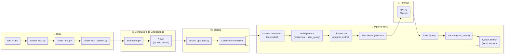
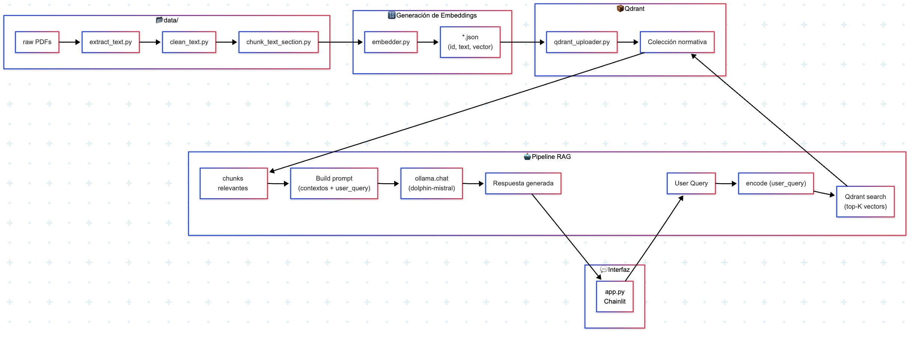

# Titulo: Asistente Virtual de Normativa Legal

## Descripción
Este proyecto implementa un asistente virtual de consulta de normativa legal en español usando una arquitectura RAG (Retrieval-Augmented Generation).  
Se ingieren documentos PDF, se procesan (limpieza, chunking por secciones y tokens), se generan embeddings con **multilingual-e5-large-instruct**, se indexan en **Qdrant**, se emplea **Ollama** como gestor de LLM ([dolphin-mistral](https://ollama.com/library/dolphin-mistral)) y se exponen a través de una UI ligera con **Chainlit**

## Objetivo
Permitir a usuarios realizar preguntas en lenguaje natural sobre textos normativos (leyes, reglamentos, etc.) y obtener respuestas precisas basadas en el contenido real de los documentos.

## Descripción de los módulos empleados

1. **Ingesta de documentos**  
   - Descarga y almacenamiento de PDFs normativos en `data/raw/`.  
   - Extracción de texto con PyMuPDF (`extract_text.py`).

2. **Procesamiento y chunking**  
   - Limpieza de texto: eliminación de cabeceras, espacios y saltos de línea innecesarios (`clean_text.py`).  
   - División inteligente por secciones (títulos, artículos) y/o tokens para garantizar que cada fragmento no supere el límite del modelo (`chunk_text_section.py`, `chunk_text.py`).

3. **Generación de embeddings**  
   - Uso de `multilingual-e5-large-instruct` (SentenceTransformers) para convertir cada chunk en un vector de 1 024 dimensiones, normalizado en L2 (`embedder.py`).

4. **Indexado en Qdrant**  
   - Despliegue de Qdrant en Docker con almacenamiento persistente.  
   - Subida de vectores + metadatos (ID, texto) a la colección `normativa` para búsquedas semánticas de alta velocidad (`qdrant_uploader.py`).

5. **Pipeline RAG**  
   - Embedding de la consulta del usuario.  
   - Recuperación de los Top-K chunks más relevantes desde Qdrant.  
   - Construcción de prompt unificado:  
     ```
     Basado en la pregunta del usuario y el contexto dado, responde la pregunta:
     
     === CONTEXT ===
     <chunk1>
     ---
     <chunk2>
     …
     
     User Query: <consulta>
     Answer:
     ```
   - Generación de la respuesta con Ollama LLM (`dolphin-mistral`) a través de su API Python (`rag_pipeline.py`).

6. **Interfaz de usuario**  
   - Chat ligero construido con Chainlit (o Streamlit): permite conversación en tiempo real, historial de preguntas y respuestas, y despliegue rápido en `http://localhost:8000` (`app.py`).

7. **Automatización y despliegue**  
   - Scripts de orquestación (`build_index.py`, `run_app.sh`) para ejecutar todo el flujo end-to-end con un solo comando.  
   - Opcional: `docker-compose.yml` para levantar Qdrant y servicios auxiliares en producción.

## Arquitectura Global





## Guía de instalación y puesta en marcha

1. **Clonar este repositorio**  

   ```bash
   git clone <tu-repo-url> rag-asistente-normativa
   cd rag-asistente-normativa
   ```

2. **Instalar Python > 3.12**

    Verifica:

    ```bash
    python --version
    ```
    2.1 Si no lo tienes, instala con pyenv (macOS/Linux):

    ```bash
    pyenv install 3.12.7
    pyenv local 3.12.7
    ```

    2.2 o desde python.org

3. **Crear y activar el virtualenv**
    ```bash
    uv sync
    source .venv/bin/activate
    python --version  # debe mostrar 3.12.x
    ```

4. **Instalar primero PyTorch (CPU)**
    ```bash
    uv pip install torch --index-url https://download.pytorch.org/whl/cpu
    ```

5. **Instalar el resto de dependencias**
    ```bash
    uv pip install -r pyproject.toml
    ```

    También se puede emplear uv sync y luego source .venv/bin/activate
6. **Configurar el IDE**

    Apuntar al intérprete .venv/bin/python.

7. **Docker & Qdrant**

    7.1 Instalar Docker Desktop y realizar login:

    ```bash
    docker login
    ```

    7.2 Descargar la imagen

    ```bash
    docker pull qdrant/qdrant
    ```

    7.3 Iniciar un contenedor persistente:

    ```bash
    docker run -d \
        --name qdrant_local \
        -p 6333:6333 \
        -v $(pwd)/qdrant_storage:/qdrant/storage \
        qdrant/qdrant
    ```

    7.4 Validar:

    ```bash
    docker ps
    ```

8. **Preprocesamiento y construcción del índice**

    ```bash
    python src/ingestion/extract_text.py
    python src/ingestion/clean_text.py
    python src/ingestion/chunk_text_section.py
    python src/embeddings/embedder.py
    python src/vector_store/qdrant_uploader.py
    ```

9. **Verifica el dashboard de Qdrant**

    Abre en tu navegador: http://localhost:6333/dashboard

10. **Instala y prepara Ollama**

    ```bash
    ollama ls
    ollama run dolphin-mistral
    ```

11. **Arranca la UI con Chainlit**

    ```bash
    ollama ls
    chainlit run src/ui/app.py
    ```
    
    Abre tu navegador en http://localhost:8000/

## Observaciones

Para chunks basados en tokens necesitarás tiktoken:

```bash
uv pip install tiktoken 
```

Puedes usar Streamlit en vez de Chainlit editando src/ui/app.py y lanzando:

```bash
streamlit run src/ui/app.py
```

## Referencias

- [RAG: Retrieval-Augmented Generation](https://medium.com/@tejpal.abhyuday/retrieval-augmented-generation-rag-from-basics-to-advanced-a2b068fd576c)
- [Chat Assistant using RAG](https://lightning.ai/lightning-ai/studios/document-chat-assistant-using-rag?section=featured)
- [MTEB Leaderboard](https://huggingface.co/spaces/mteb/leaderboard)
- [distiluse-base-multilingual-cased-v1](https://huggingface.co/sentence-transformers/distiluse-base-multilingual-cased-v1)
- [Qdrant Docker Hub](https://hub.docker.com/r/qdrant/qdrant)
- [Ollama Models](https://ollama.com/search)
- [Ollama Models: dolphin-mistral](https://ollama.com/library/dolphin-mistral)  
- [Chainlit](https://docs.chainlit.io/get-started/overview)
- [Anthropic: Contextual Retrieval](https://www.anthropic.com/news/contextual-retrieval)